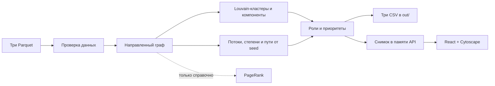

# Граф денег

Локальный инструмент для поиска новых точек сбора средств за пределами 81 известного исходного клиента: показывает сеть обезличенных переводов и объясняет, кого проверять дальше. Роль, сила признаков и приоритет не устанавливают виновность и не доказывают происхождение конкретных денег.


## Данные и запуск

Распакуйте выданный организаторами архив в корень проекта; три файла должны лежать в `data/`:

```text
data/nodes.parquet
data/edges.parquet
data/transactions.parquet
```

После этого Docker соберёт и запустит приложение одной командой:

```bash
docker compose up --build -d --wait
```

Откройте [http://localhost:8000](http://localhost:8000). Остановка: `docker compose down`. Python на хосте для Docker-сценария не нужен. Если архив недоступен локально, необязательный запасной способ — `python3 scripts/fetch_data.py`.

### Только расчёт CSV

Для расчёта без веб-интерфейса достаточно `uv` и данных в `data/`:

```bash
uv run python -m backend.pipeline --data data --out out
```

`uv` установит Python-зависимости из lock-файла при первом запуске.

### Локальный веб-интерфейс

Нужны Python, `uv`, Node.js 24 и npm. Из корня проекта:

```bash
uv sync --frozen
npm --prefix frontend ci
npm --prefix frontend run build
uv run uvicorn backend.app:app --host 127.0.0.1 --port 8000
```

Переменные `MONEY_GRAPH_DATA`, `MONEY_GRAPH_OUT` и `MONEY_GRAPH_STATIC` настраиваются через окружение процесса; `.env.example` автоматически не загружается.

## Результаты

В репозитории уже лежат результаты для выданного набора. Команда CLI воспроизводит их как обычные CSV в `out/`:

- [`nodes_roles.csv`](out/nodes_roles.csv) — структурная роль, сила признаков, приоритет и пояснение для каждого узла;
- [`clusters.csv`](out/clusters.csv) — размер и состав кластера, внутренний оборот и гипотеза;
- [`top_nodes.csv`](out/top_nodes.csv) — до 100 кандидатов с объяснением приоритета.

При записи каждый CSV сначала готовится во временном файле и затем заменяется отдельно; общей атомарности сразу для трёх файлов нет. API при старте один раз рассчитывает снимок в памяти и отдаёт его поля и CSV-выгрузки из этого снимка. Схемы и маршруты описаны в [контракте API](docs/api-contract.md).

## Роли и приоритет

Условия проверяются по порядку; первое совпадение задаёт основную роль. `d` и `o` — числа непосредственных входящих и исходящих соседей. Форма узла сбора (`collector_shape`) нужна также для подсчёта ветвей координатора: узел не seed и не граница depth=4, `d ≥ 2`, входящий оборот положителен, а `out_kzt / in_kzt ≤ 0,8`. Правило формы не зависит от итоговой роли и глубины предшественника.

| Порядок и роль | Условие |
|---|---|
| 1. `coordinator` | Не seed и не boundary; получает от `≥2` непосредственных узлов `collector_shape`; `o ≥ 2` |
| 2. `consolidator` | Узел соответствует `collector_shape` |
| 3. `distributor` | `o ≥ 5` и `o ≥ 2 × max(d, 1)` |
| 4. `transit` | `pass_through` определён, `d > 0`, `o > 0`, `0,8 ≤ out_kzt / in_kzt ≤ 1,2` |
| 5. `terminal` | `d > 0`, `o = 0`, не seed и не boundary depth=4 |
| 6. `peripheral` | Ни одно предыдущее условие не выполнено |

`collector_shape` считается по исходным сетевым признакам, а не по уже назначенной роли; это исключает круговое правило. `collecting_branches` — число таких непосредственных плательщиков. Это структурные гипотезы, а не установленные организаторы.

Приоритет — взвешенная сумма четырёх нормированных признаков:

```text
base = 0,35·s/(s+1) + 0,30·d/(d+3) + 0,20·v/(v+500000)
       + 0,15·h·(1−1/d), если d≥2 и o>0; иначе последний член = 0
priority_score = factor · base
factor = 0,5 для seed; 0,85 для depth=4; 1 для остальных
```

Здесь `s=seed_source_count`, `v=in_kzt`, `h=out_concentration` — HHI долей исходящего оборота по получателям. Веса и константы насыщения — эвристики, не обученные на размеченных данных. Роль и PageRank на приоритет не влияют. `role_score` — сила структурных признаков, округлённая до шести знаков; верхние границы: 0,85 для seed и 0,75 для depth=4. Подробности, формулы силы роли и ограничения — в [методологии](docs/methodology.md).

## Схема



## Данные и границы выводов

Набор за июль 2026 года содержит 2 248 узлов, 3 119 рёбер, 4 840 транзакций и 81 seed; расчёт выделяет 91 кластер, 35 слабосвязных компонент, 19 изолятов и 444 узла на границе depth=4. Вне выборки остаются переводы ниже 5 000 KZT, внешние операции и атрибуты клиентов. Граф следует только по исходящим переводам до четырёх колен; входящие суммы seed могут быть неполны, а за границей depth=4 продолжение неизвестно. Пути от seed показывают достижимость по наблюдаемым рёбрам, не атрибуцию денег и не хронологию.

Последний расчёт: 265 consolidator, 68 transit, 118 distributor, 936 terminal, 2 coordinator и 859 peripheral. В топ-20 — 18 consolidator, 1 peripheral и 1 distributor; seed нет. Это диагностика распределения гипотез, а не доказательство точности без ground truth. Два примера гипотезы coordinator: `100000002224132100` (2 ветви сбора, 5 входящих и 4 исходящих соседа; выход/вход 3,07) и `100000003390036100` (2 ветви, 2 входящих и 2 исходящих; выход/вход 0,268). В первом случае предупреждение о превышении исходящего оборота подчёркивает неполноту баланса.

Для короткой ручной проверки откройте в поиске интерфейса `100000003115284100` (consolidator), `100000002224132100` (coordinator) и `100000006638021100` (boundary depth=4). Это примеры из данного набора, не универсальные образцы ролей.

Масштаб около миллиона узлов не реализован и не тестировался. Путь к нему потребует замеров на реальных объёмах: колоночной агрегации, компактного CSR/igraph, приближённых метрик и сообществ по частям, индексированных списков смежности API и ограничения отрисовываемого подграфа.

## Проверки

```bash
uv run pytest -q
uv run ruff check backend tests scripts
npm --prefix frontend test
npm --prefix frontend run lint
npm --prefix frontend run typecheck
```

Подробности проверок и их границы — в [QA-отчёте](docs/qa-report.md).

## Источники и состав проекта

Данные обезличены, `gid` — синтетические идентификаторы. Набор предоставлен для использования в рамках хакатона; исходные Parquet не включены в репозиторий.

- [Задание организаторов](https://docs.google.com/document/d/1JPLU-G6R25Ge2hVaY2J9cqvrx7FGExj87XKwJPaMz3o/edit)
- [Архив данных](https://drive.google.com/file/d/1yHdWaSb6gwPAUrqco-KrwR2U_YhzFQFT/view) и [README набора](https://drive.google.com/file/d/1ro-SiY042jv7De0h7tXBDyY8ZKdHz_US/view)
- Версии и лицензии зависимостей: [реестр сторонних компонентов](docs/third-party.md)

Исходный репозиторий организаторов назывался `hack-6fcd7f48-agentforge`; его история сохранена. При разработке использовался Codex (Astra, Sol, Luna); эти инструменты не нужны для запуска приложения.
