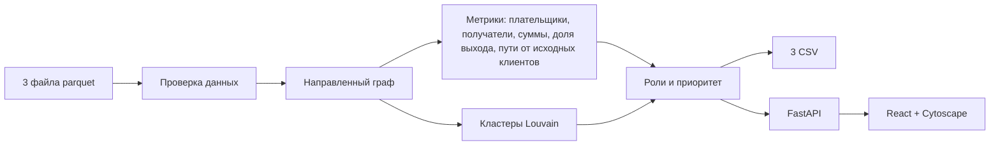

# Граф денег

Инструмент для AML-аналитика: по выгрузке переводов строит сеть, присваивает каждому клиенту роль и показывает, кого проверять первым и почему.


## Зачем

Банку известны 81 клиент, связанные с незаконным оборотом наркотиков. Это нижний уровень схемы: курьеры, получавшие деньги. Выгрузка их исходящих переводов на четыре колена даёт сеть из 2 248 клиентов, и вручную понять, кто в ней собирает деньги, через кого они проходят и где оседают, — это часы работы на каждый узел.

Граф денег делает это за секунды:

- присваивает каждому из 2 248 клиентов роль: точка сбора, транзит, распределитель, конечный получатель, координатор или периферия;
- ранжирует клиентов по приоритету проверки и объясняет каждую позицию обычным текстом, например «Плательщиков — 8; дальше отправлено 23,9% входа»;
- делит сеть на кластеры и формулирует гипотезу о назначении каждого;
- показывает схему переводов с направлениями, поиском по gid и путями от известных клиентов до выбранного узла.

Фокус смещается с 81 уже известного курьера на тех, к кому их деньги сходятся. Известные клиенты намеренно опущены в приоритете, и в топ-100 их нет.

Все выводы — гипотезы для проверки, а не утверждение о виновности.

## Запуск

Распакуйте архив с данными от организаторов в корень проекта:

```text
data/nodes.parquet
data/edges.parquet
data/transactions.parquet
```

### Docker: всё одной командой

```bash
docker compose up --build -d --wait
```

Откройте <http://localhost:8000>. CSV можно скачать из меню «Скачать CSV» в интерфейсе. Остановка: `docker compose down`.

### Только расчёт CSV

Нужен [uv](https://docs.astral.sh/uv/getting-started/installation/). Он сам установит нужную версию Python и зависимости.

```bash
uv run python -m backend.pipeline
```

Команда читает `data/`, пишет три CSV в `out/` и укладывается в секунды (лимит задания — 5 минут).

### Веб-интерфейс без Docker

Нужны uv и Node.js 24:

```bash
uv sync --frozen
npm --prefix frontend ci
npm --prefix frontend run build
uv run uvicorn backend.app:app --port 8000
```

Откройте <http://localhost:8000>.

Если архива нет под рукой, `python3 scripts/fetch_data.py` скачает его по публичной ссылке организаторов и проверит контрольную сумму. Пути к данным и выгрузкам можно переопределить переменными из [`.env.example`](.env.example).

## Результаты

Готовые выгрузки для выданного набора лежат в репозитории:

| Файл | Содержимое |
|---|---|
| [`out/nodes_roles.csv`](out/nodes_roles.csv) | Все 2 248 узлов: `gid`, `role`, `role_score`, `cluster_id`, `priority_score`, `evidence` |
| [`out/clusters.csv`](out/clusters.csv) | 91 кластер: размер, число исходных клиентов, внутренний оборот, топ-5 узлов, гипотеза |
| [`out/top_nodes.csv`](out/top_nodes.csv) | 100 узлов для первоочередной проверки с обоснованием `why` |

Распределение ролей: 265 точек сбора, 68 транзитных, 118 распределителей, 936 конечных получателей, 2 координатора, 859 периферийных. В топ-20 — 18 точек сбора, 1 распределитель и 1 периферийный узел.

Для демонстрации удобно открыть три узла:

| gid | Что показывает |
|---|---|
| `100000003115284100` | Точка сбора: 8 плательщиков, получено 2 160 500 ₸, дальше ушло 24% |
| `100000002224132100` | Кандидат в координаторы: получает от двух точек сбора, отправляет в 3 раза больше, чем получил в выборке |
| `100000006638021100` | Граница 4-го колена: исходящих нет, но это обрыв выгрузки, а не «деньги осели» |

## Как определяются роли

Правила проверяются по порядку, срабатывает первое подходящее. `d` — число разных плательщиков узла, `o` — число разных получателей, «доля выхода» — сколько от полученного узел отправил дальше.

**Точка сбора** в этой таблице — узел, который не является исходным клиентом, не лежит на 4-м колене, получает от 2 и более плательщиков и отправляет дальше не больше 80% полученного.

| Роль | Правило | Смысл |
|---|---|---|
| `coordinator` | Получает от 2 и более точек сбора и отправляет 2 и более получателям; не исходный клиент и не 4-е колено | Узел над точками сбора — кандидат в организаторы |
| `consolidator` | Сам является точкой сбора | Собирает деньги от нескольких участников и удерживает их |
| `distributor` | `o ≥ 5` и `o ≥ 2·d` | Веерная рассылка на много получателей |
| `transit` | Доля выхода от 0,8 до 1,2; есть и входящие, и исходящие; не исходный клиент | Пропускает деньги дальше, почти не удерживая |
| `terminal` | Есть входящие, нет исходящих; не исходный клиент и не 4-е колено | Деньги пришли и остались |
| `peripheral` | Ничего из перечисленного | Признаков роли нет |

`role_score` (0–1) показывает, насколько ярко выражены признаки. Например, у точки сбора он растёт с числом плательщиков и долей удержанных денег. Формулы для каждой роли приведены в [методологии](docs/methodology.md).

### Приоритет проверки

Приоритет отвечает на вопрос «кого смотреть первым» и от роли не зависит:

| Признак | Вес | Почему важен |
|---|---:|---|
| От скольких исходных клиентов есть путь до узла | 35% | Деньги нескольких курьеров сходятся в одном месте |
| Число разных плательщиков | 30% | Широта сбора |
| Сумма входящих переводов | 20% | Масштаб |
| Насколько выход сосредоточен на одном получателе | 15% | Деньги собраны и переданы одному адресату |

Каждый признак сглажен, чтобы крупные значения не забивали остальные: `s/(s+1)`, `d/(d+3)`, `v/(v+500 000)`. Итог умножается на 0,5 для исходных клиентов (они уже известны) и на 0,85 для узлов 4-го колена (данные о них обрезаны). Карточка клиента в интерфейсе раскладывает приоритет на эти составляющие.

## Как учтены ограничения данных

| Особенность выгрузки | Что сделано |
|---|---|
| 444 узла на 4-м колене не имеют исходящих из-за обрыва обхода | Они не считаются конечными получателями и не могут быть точкой сбора или координатором; в карточке есть предупреждение |
| Входящие переводы исходных клиентов видны не полностью | Долю выхода для них не считаем, `role_score` ограничен 0,85, приоритет умножен на 0,5 |
| Многие узлы отправили больше, чем получили в выборке | Обоснование предупреждает, что выход выше входа и баланс неполон |
| 19 исходных клиентов без переводов, 16 несвязанных частей сети | Изоляты получают свой кластер и пометку «связей в выборке нет» |
| Нет переводов меньше 5 000 ₸ и атрибутов клиентов | Используются только структура и суммы; ничего не достраивается |

Пути от исходных клиентов показывают, что узел достижим по наблюдаемым переводам. Это не доказывает, что до него дошли те же самые деньги.

## Как устроено



```text
backend/pipeline.py   расчёт: загрузка, граф, роли, приоритет, кластеры, CSV
backend/app.py        API и раздача интерфейса
frontend/src/         интерфейс: список приоритетов, граф, карточка клиента
scripts/fetch_data.py загрузка архива данных
tests/                тесты расчёта и API
```

Пайплайн детерминирован: у Louvain фиксированный seed, и повторный запуск даёт те же CSV. Интерфейс получает данные из того же расчёта, что и выгрузки. Контракт API описан в [docs/api-contract.md](docs/api-contract.md), устройство компонентов — в [docs/architecture.md](docs/architecture.md).

## Масштабирование до ~1 млн узлов

Сейчас весь граф строится в памяти через NetworkX. Это нормально для тысяч узлов, но не для миллиона. Что пришлось бы изменить:

- **Хранение и агрегация.** Считать степени и суммы колоночно в Polars или DuckDB прямо по parquet. Граф держать в компактном виде (CSR в igraph или graph-tool), а не в словарях Python.
- **Пути от исходных клиентов.** Вместо хранения путей для каждой пары «клиент → узел» считать только число достижимых исходных клиентов одним проходом по коленам. Примеры путей строить по запросу.
- **Кластеризация.** Запускать Louvain или Leiden отдельно для каждой связной компоненты, крупные компоненты обрабатывать параллельно.
- **API.** Заранее построить индекс смежности, чтобы окрестность узла отдавалась без полного прохода по рёбрам.
- **Интерфейс.** Не отрисовывать всю сеть: только окрестность узла или кластеры, свёрнутые в один узел.

## Проверки

```bash
uv run pytest -q
uv run ruff check backend tests scripts
npm --prefix frontend test
npm --prefix frontend run lint
npm --prefix frontend run typecheck
```

## Стек и источники

Python (FastAPI, pandas, PyArrow, NetworkX), React, TypeScript, Cytoscape.js, Vite. Решение работает локально, не использует LLM, платные сервисы и внешние API. Версии и лицензии всех зависимостей — в [docs/third-party.md](docs/third-party.md). При разработке использовался Codex; для запуска он не нужен.

Данные обезличены (`gid` — синтетический идентификатор) и предоставлены организаторами HackAlem только для хакатона. Исходные parquet в репозиторий не включены.

- [Задание](https://docs.google.com/document/d/1JPLU-G6R25Ge2hVaY2J9cqvrx7FGExj87XKwJPaMz3o/edit)
- [Архив данных](https://drive.google.com/file/d/1yHdWaSb6gwPAUrqco-KrwR2U_YhzFQFT/view) и [описание полей](https://drive.google.com/file/d/1ro-SiY042jv7De0h7tXBDyY8ZKdHz_US/view)
