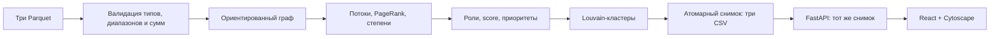

# Граф денег

AML-аналитик получает локальную карту обезличенных переводов с объяснимыми гипотезами о ролях и очередностью проверки узлов.


[Запуск](#быстрый-старт) · [Проверка](#проверки-и-статус)

- Пересчитывает 2 248 узлов, 3 119 связей и 4 840 переводов за 0,99 с полного CLI-прогона в чистой копии.
- Объясняет шесть структурных ролей через степени, потоки и PageRank, с отдельными оговорками для seed и границы обхода.
- Даёт поиск любого `gid`, интерактивный граф с направлениями, фильтры по роли/кластеру, раскрываемый разбор компонентов приоритета и три выгрузки CSV.

Краткий [UI/UX-аудит](docs/ui-ux-audit.md) описывает мобильную компоновку, читаемость и проверенные ограничения.

Роль и приоритет — гипотезы для проверки; они не являются вероятностью виновности и не устанавливают её.

## Быстрый старт

Проверенная ОС — Linux; файловая система должна поддерживать POSIX symlinks. Python 3.14.3, `uv` 0.12.16, Node.js 24.21.0 и npm 11.19.0. Для контейнерного запуска нужны Docker 29.8.1 и Compose 5.5.1. macOS и WSL не проверялись. Чистая локальная копия прошла установку зависимостей, загрузку данных, тесты, CLI, frontend build, Docker и браузерную проверку.

Все команды запускайте из корня проекта. Сначала установите зависимости и соберите UI, затем получите dataset. Скрипту получения данных нужен Python 3.10+ и интернет; для offline используйте предоставленный ZIP. В чистой копии `uv sync --frozen` установил 30 Python packages, `npm ci` — 193 npm packages, затем fetch сверил официальный SHA-256.

```bash
uv sync --frozen
npm --prefix frontend ci
npm --prefix frontend run build
python3 scripts/fetch_data.py
uv run python -m backend.pipeline --data data --out out
uv run uvicorn backend.app:app --host 127.0.0.1 --port 8000
```

Откройте `http://localhost:8000`. Идите по техническому сценарию из трёх узлов ниже, затем сравните объяснения с их входящими и исходящими связями. Блок приоритета в карточке показывает исходный оборот, число связей, PageRank, вес роли и формулу ранжирования.

`uv sync --frozen` и прочие команды читают переменные окружения процесса. `.env.example` — образец значений, он автоматически не загружается. По умолчанию используются каталоги `data`, `out` и `frontend/dist`; при необходимости экспортируйте `MONEY_GRAPH_DATA`, `MONEY_GRAPH_OUT`, `MONEY_GRAPH_STATIC` до запуска.

### Offline dataset

Загрузчик проверяет SHA-256 архива и сигнатуры трёх Parquet-файлов. Архив, используемый при проверке: `0ce15a932439d076033cba159ca7ede8bf49f188892bb4cc0809b1af49492d72`.

```bash
python3 scripts/fetch_data.py --archive /path/to/archive.zip
```

### Docker Compose

На машине нужен Python 3.10+ для получения dataset. Сначала выполните fetch на хосте, затем соберите и запустите приложение:

```bash
python3 scripts/fetch_data.py
docker compose up --build -d --wait
```

Compose запускает один сервис на `127.0.0.1:8000`; `data/` доступен контейнеру только для чтения, `out/` — для записи. Проверка health включена в compose wait. Остановить приложение можно командой `docker compose down`.

## Техническая проверка за пять минут

Загрузчик получает обезличенный dataset организаторов. CLI или старт API рассчитывает единый снимок: три CSV, summary и данные для графа. Затем в веб-интерфейсе найдите по очереди три узла и проверьте карточку, карту и смысл предупреждений:

| `gid` | Что проверить в данных и объяснении |
|---|---|
| `100000003684369100` | Seed: 24 входящих и 62 исходящих связи; входы seed неполны, поэтому `role_score` ограничен 0,85. |
| `100000003115284100` | Признаки сбора: 8 плательщиков, вход 2 160 500 KZT, выход 517 000 KZT. |
| `100000006638021100` | Граница depth=4: вход 388 500 KZT от двух плательщиков; отсутствие дальнейших исходящих не должно показываться как доказанный `terminal`. |

Это примеры записей текущего набора для проверки объяснений, а не зашитые ответы: поиск доступен и для других `gid`. UI-приёмка охватила поиск изолированного и неизвестного узлов, пустые фильтры роли/кластера, выбор узла на графе, приближение и вписывание графа, связи в карточке, сводку кластера и предупреждение о границе данных.

В режиме узла входящие связи размещены слева, исходящие справа, взаимные — снизу. Сначала показаны 20 контрагентов с наибольшей суммой прямых переводов в обе стороны. Кнопка «Показать всех» раскрывает уже загруженную окрестность в пределах 120 узлов, включая выбранный; под графом указано фактическое количество узлов и связей. Автоматическое вписывание не увеличивает маленький граф чрезмерно. Подписи видны у выбранного узла и при приближении. Наведение или нажатие на связь выделяет её и показывает полные `gid`, сумму до двух знаков и число переводов.

Интерфейс проверен в IAB Chromium на viewport 320×740, 390×844, 768×1024, 1024×900 и 1440×1000; горизонтального переполнения нет, высота графа ограничена размером окна. Выбранная карточка сохраняется при фильтрации: если узел не входит в список, интерфейс объясняет это и позволяет сбросить фильтр. Подробные сценарии и численные результаты — в [QA-отчёте](docs/qa-report.md) и [UI/UX-аудите](docs/ui-ux-audit.md). Большие обзорные графы требуют приближения и выбора отдельных узлов; в плотных областях возможны пересечения связей и подписей. Приоритет отображается с тремя знаками, а `role_score` — как «Сила признаков роли» в процентах.

## Результаты и архитектура

На наборе обработано 2 248 узлов, 3 119 рёбер, 4 840 транзакций, 81 seed и 444 узла на границе глубины 4. Сумма оборота — 365 890 012,01 KZT. Pipeline выделил 91 кластер и 35 слабосвязных компонент: 16 компонент с рёбрами и 19 изолированных узлов. Вне крупнейшей компоненты 371 узел, включая 19 isolates (352 неизолированных).

Частоты ролей: 31 `consolidator`, 62 `transit`, 123 `distributor`, 1 071 `terminal`, 20 `coordinator`, 941 `peripheral`. Восемь кластеров содержат более одного seed. Эти числа относятся к текущим правилам, а не к ground truth.



Результаты доступны в `out/nodes_roles.csv`, `out/clusters.csv` и `out/top_nodes.csv`. Один расчёт пишет три файла в `out/.snapshots/<id>`, затем атомарно обновляет `out/current`; корневые CSV-ссылки указывают на опубликованный полный снимок. Повторный расчёт дал идентичные байты CSV. API при старте считает снимок один раз; GET-запросы читают его и предоставляют поиск, карточки, кластеры, граф и выгрузки. После замены входных Parquet перезапустите API, чтобы обновить его снимок.

Выходные схемы и детали методов приведены в [архитектуре](docs/architecture.md), [методологии](docs/methodology.md) и [API-контракте](docs/api-contract.md). [Матрица критериев](docs/criteria.md) связывает требования с реализацией и проверками.

## Данные и ограничения

Вход: `nodes.parquet`, `edges.parquet`, `transactions.parquet` за июль 2026 года. Dataset обезличен и выдан исключительно для хакатона. `data/` и `out/` не входят в репозиторий. Источники: [архив](https://drive.google.com/file/d/1yHdWaSb6gwPAUrqco-KrwR2U_YhzFQFT/view), [README данных](https://drive.google.com/file/d/1ro-SiY042jv7De0h7tXBDyY8ZKdHz_US/view), [задание](https://docs.google.com/document/d/1JPLU-G6R25Ge2hVaY2J9cqvrx7FGExj87XKwJPaMz3o/edit).

Выборка включает только исходящие переводы до четырёх колен; суммы меньше 5 000 KZT, внешние переводы и атрибуты клиентов отсутствуют. Входящие суммы seed неполны, эталонных меток нет. Нулевой `out_degree` на глубине 4 вызван границей выгрузки. Поэтому не следует трактовать роль или score как доказательство, полный баланс или факт виновности. Карточка сообщает, что проверить дальше, и показывает предупреждения для seed и граничных узлов.

Интерфейс отображает до 120 узлов одновременно и явно показывает размер выбранной части сети. Расчёты охватывают все узлы; для детализации используйте поиск и фильтр кластера. Старые снимки CSV сохраняются в `out/.snapshots`; автоматическая очистка не предусмотрена.

## Проверки и статус

Проверки можно повторить после установки зависимостей и получения dataset:

```bash
uv run pytest -q
uv run ruff check backend tests scripts
npm --prefix frontend test
npm --prefix frontend run lint
npm --prefix frontend run typecheck
npm --prefix frontend run build
```

- `pytest`: 24 теста пройдены за 3,04 с в чистой копии, включая регрессию на переполнение агрегатов конечных сумм около `1e308`; Ruff PASS.
- Frontend lint, typecheck и production build — PASS; `npm audit` сообщил 0 уязвимостей.
- После рефакторинга 24 Python-теста проходят, а JSON-снимок без времени выполнения и три CSV побайтно совпадают с результатом до правки. Проверка URL-режимов проходит в Node test runner. В браузере с намеренно задержанным ответом списка ручной выбор узла сохраняется после завершения загрузки.
- Полный CLI в чистой копии — 0,99 с; внутренний анализ занял 0,510786 с. API smoke проверил конечные JSON-значения, неизвестный `gid` (`404`), отсутствие данных (`503`), граничные предупреждения и маршруты CSV.
- В чистой копии summary API готов; все три CSV endpoint вернули HTTP 200 с attachment и ожидаемыми заголовками. Ответы содержат 2 248 / 91 / 100 строк и побайтно совпадают со снимком `out`; браузер получил download event для каждой выгрузки.
- В чистой копии Docker Compose build и `up --wait` завершились успешно, сервис healthy. Локальная браузерная приёмка на 1440 и 390 px подтвердила карточку и граф реального узла, раскрытый числовой разбор приоритета, поиск и скачивание CSV; горизонтального переполнения и ошибок JavaScript не было. Плотный граф остаётся известным ограничением: узлы и подписи могут пересекаться.
- Чистый remote clone на коммите `94cc8a8` прошёл получение данных, Python/frontend проверки, Docker и HTTP-проверку трёх CSV. GitHub Actions job не запустился из-за billing lock организации/аккаунта; это не ошибка приложения. Текущий статус — в [GitHub Actions](https://github.com/BAITC-Hacks/hack-6fcd7f48-agentforge/actions/workflows/verify.yml), workflow — [verify.yml](.github/workflows/verify.yml).

## Используемые технологии

Python 3.14, FastAPI, Uvicorn, pandas, PyArrow, NetworkX и Pydantic; React, Cytoscape, TypeScript и Vite. При разработке использовался Codex (Astra, Sol, Luna); эти инструменты не нужны для запуска продукта. Версии, источники и лицензии библиотек, lock-записи и контейнерных образов собраны в [реестре сторонних компонентов](docs/third-party.md).

Путь к миллиону узлов — исследовательский план, а не текущая возможность. Варианты развития — колоночная агрегация, хранение CSR/igraph, приближённые PageRank и кластеризация по компонентам, индексированные adjacency для API и ограниченный рендер подграфов. Требуются замеры памяти, времени и качества.

## Происхождение

Выданный приватный репозиторий изначально назывался `hack-6fcd7f48-agentforge`, а его README содержал `Hackathon team repository for AgentForge`. Исходная история сохранена; название продукта — «Граф денег».
