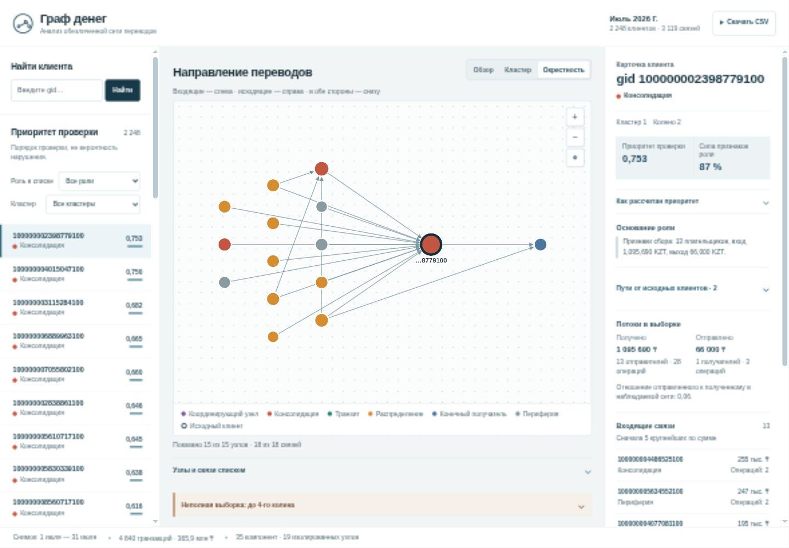
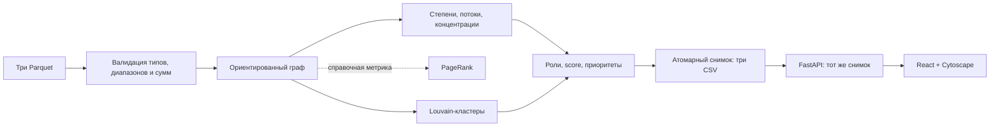

# Граф денег

Локальный инструмент для поиска новых точек сбора средств за пределами 81 известного исходного клиента. Обезличенная сеть переводов, объяснимые роли и приоритеты помогают аналитику выбрать следующие узлы для проверки.



[Запуск](#быстрый-старт) · [Проверка](#проверки-и-статус)

- Пересчитывает 2 248 узлов, 3 119 связей и 4 840 переводов из официального набора.
- Даёт шесть структурных ролей по связям, оборотам и наблюдаемым путям от seed; PageRank служит только справочной метрикой.
- Даёт поиск любого `gid`, интерактивный граф с направлениями, фильтры по роли/кластеру, раскрываемый разбор компонентов приоритета и три выгрузки CSV.

Краткий [UI/UX-аудит](docs/ui-ux-audit.md) описывает мобильную компоновку, читаемость и проверенные ограничения.

Роль и приоритет — гипотезы для проверки; они не являются вероятностью виновности и не устанавливают её.

## Быстрый старт

Проверенная ОС — Linux; файловая система должна поддерживать POSIX symlinks. Python 3.14.3, `uv` 0.12.16, Node.js 24.21.0 и npm 11.19.0. Для контейнерного запуска нужны Docker 29.8.1 и Compose 5.5.1. macOS и WSL не проверялись. Чистая локальная копия прошла установку зависимостей, загрузку данных, тесты, CLI, frontend build, Docker и браузерную проверку.

Все команды запускайте из корня проекта. Сначала установите зависимости и соберите UI, затем получите dataset. Скрипту получения данных нужен Python 3.10+ и интернет; для offline используйте предоставленный ZIP. В чистой копии `uv sync --frozen` установил 30 Python packages, `npm ci` — 193 npm packages, затем fetch сверил официальный SHA-256.

```bash
uv sync --frozen
npm --prefix frontend ci
npm --prefix frontend run build
python3 scripts/fetch_data.py
uv run python -m backend.pipeline --data data --out out
uv run uvicorn backend.app:app --host 127.0.0.1 --port 8000
```

Откройте `http://localhost:8000`. Идите по техническому сценарию из трёх узлов ниже, затем сравните объяснения с входящими и исходящими связями. Карточка показывает компоненты приоритета и применённый к seed/границе коэффициент.

`uv sync --frozen` и прочие команды читают переменные окружения процесса. `.env.example` — образец значений, он автоматически не загружается. По умолчанию используются каталоги `data`, `out` и `frontend/dist`; при необходимости экспортируйте `MONEY_GRAPH_DATA`, `MONEY_GRAPH_OUT`, `MONEY_GRAPH_STATIC` до запуска.

### Offline dataset

Загрузчик проверяет SHA-256 архива и сигнатуры трёх Parquet-файлов. Архив, используемый при проверке: `0ce15a932439d076033cba159ca7ede8bf49f188892bb4cc0809b1af49492d72`.

```bash
python3 scripts/fetch_data.py --archive /path/to/archive.zip
```

### Docker Compose

На машине нужен Python 3.10+ для получения dataset. Сначала выполните fetch на хосте, затем соберите и запустите приложение:

```bash
python3 scripts/fetch_data.py
docker compose up --build -d --wait
```

Compose запускает один сервис на `127.0.0.1:8000`; `data/` доступен контейнеру только для чтения, `out/` — для записи. Проверка health включена в compose wait. Остановить приложение можно командой `docker compose down`.

## Техническая проверка за пять минут

Загрузчик получает обезличенный dataset организаторов. CLI или старт API рассчитывает единый снимок: три CSV, summary и данные для графа. Затем в веб-интерфейсе найдите по очереди три узла и проверьте карточку, карту и смысл предупреждений:

| `gid` | Что проверить в данных и объяснении |
|---|---|
| `100000003684369100` | Seed: 24 входящих и 62 исходящих связи; входы seed неполны, поэтому `role_score` ограничен 0,85. |
| `100000003115284100` | Признаки сбора: 8 плательщиков, вход 2 160 500 KZT, выход 517 000 KZT. |
| `100000006638021100` | Граница depth=4: вход 388 500 KZT от двух плательщиков; отсутствие дальнейших исходящих не должно показываться как доказанный `terminal`. |

Это примеры записей текущего набора для проверки объяснений, а не зашитые ответы: поиск доступен и для других `gid`. UI-приёмка охватила поиск изолированного и неизвестного узлов, пустые фильтры роли/кластера, выбор узла на графе, приближение и вписывание графа, связи в карточке, сводку кластера и предупреждение о границе данных.

В режиме узла входящие связи размещены слева, исходящие справа, взаимные — снизу. Сначала показаны 20 контрагентов с наибольшей суммой прямых переводов в обе стороны. Кнопка «Показать всех» раскрывает уже загруженную окрестность в пределах 120 узлов, включая выбранный; под графом указано фактическое количество узлов и связей. Автоматическое вписывание не увеличивает маленький граф чрезмерно. Подписи видны у выбранного узла и при приближении. Наведение или нажатие на связь выделяет её и показывает полные `gid`, сумму до двух знаков и число переводов.

## Роли и приоритет

Правила применяются в указанном порядке; первое совпадение назначает основную роль. `d` и `o` — число непосредственных входящих и исходящих связей. Узел-плательщик является ветвью сбора, если `d ≥ 3` и (`o ≤ 2` или `d ≥ 2o`).

| Порядок, роль | Условие |
|---|---|
| 1. `consolidator` | `d ≥ 3` и (`o ≤ 2` или `d ≥ 2o`) |
| 2. `distributor` | `o ≥ 5` и `o ≥ 2 × max(d, 1)` |
| 3. `transit` | Не seed; отношение выхода ко входу определено, `d > 0`, `o > 0` и `0,8 ≤ out_kzt / in_kzt ≤ 1,2` |
| 4. `coordinator` | Остаточная гипотеза: не seed; пути от `≥2` seed; `≥2` непосредственных не-seed плательщика с признаками сбора на меньшей глубине; `d ≥ 2`, `o ≥ 2`; получатели в `≥2` сообществах |
| 5. `terminal` | `d > 0`, `o = 0`, не seed и не depth-4 boundary |
| 6. `peripheral` | Ни одно предыдущее правило не подошло |

Координатор не назначается ради заполнения квоты: нулевое число допустимо. Для каждого seed путь строится только по рёбрам к большей глубине; берётся один кратчайший путь, при равной длине — лексикографически меньший по числовым `gid`. Собственный путь seed к себе исключён: для seed число источников равно 0. API показывает до трёх примеров, отсортированных по длине и числовой последовательности gid. Это наблюдаемая достижимость, не атрибуция денег и не хронология операций.

PageRank остаётся справочной метрикой и не влияет на роль или приоритет. Для `s=seed_source_count`, `d=in_degree`, `v=in_kzt`, `h=out_concentration`, `o=out_degree`:

```text
base = 0,35·s/(s+1) + 0,30·d/(d+3) + 0,20·v/(v+500000)
       + 0,15·h·(1−1/d), если d≥2 и o>0; иначе последний член = 0
priority_score = factor · base
factor = 0,5 для seed; 0,85 для depth=4 boundary; 1,0 для остальных
```

`h` — HHI исходящих сумм: сумма квадратов долей каждого получателя в `out_kzt`. Добавки `+1`, `+3`, `+500000` задают мягкое насыщение; веса и константы — эвристики, не обученные на размеченных данных. `role_score` ограничивается сверху 0,85 для seed и 0,75 для depth=4 boundary.

Результат округляется до 6 знаков; порядок — score по убыванию, затем числовой `gid` по возрастанию. В новом расчёте top-10 — все consolidator без seed; top-20 — 17 consolidator, 2 peripheral и 1 distributor без seed. Это соответствует цели выделять схождение потоков, но без ground truth не доказывает рост точности. Изменение каждого веса на ±20% по очереди с перенормировкой сохранило 16–19 узлов исходного top-20 и ноль seed во всех восьми вариантах; это проверка чувствительности списка, не точности.

Подробнее — [методология и ограничения](docs/methodology.md); схема полей — в [API-контракте](docs/api-contract.md).

После упрощения интерфейс проверен в IAB Chromium при ширине 320, 390, 768, 1024 и 1440 px: горизонтального переполнения нет; точные размеры окна и области графа приведены в [QA-отчёт](docs/qa-report.md). Выбранная карточка сохраняется при фильтрации: если узел не входит в список, интерфейс объясняет это и позволяет сбросить фильтр. Большие обзорные графы требуют приближения и выбора отдельных узлов; в плотных областях возможны пересечения связей и подписей. Приоритет отображается с тремя знаками, а `role_score` — как «Сила признаков роли» в процентах.

### Упрощение интерфейса

Выгрузки собраны в одном раскрывающемся меню, поиск очищается после выбора, номера мест убраны, а метаданные не оформлены как кнопки. Кнопка «Кластер» открывает выбранный в фильтре кластер, а при отсутствии фильтра — кластер клиента; пояснения и следующие шаги сворачиваются, предупреждения seed и границы остаются видны. Связи отсортированы по сумме: сначала пять входящих и исходящих, остальные раскрываются отдельно; при выборе другого узла список сворачивается.

Проверено в браузере: все три CSV скачиваются; поиск, переход к кластеру, смена фильтров, карточка, граф и клавиатурный выбор ребра работают. На мобильных размерах проверены обработка неправильного `gid`, фокус навигации, отсутствие горизонтального переполнения и основные действия графа. Подробности и границы проверки — в [QA-отчёте](docs/qa-report.md).

## Результаты и архитектура

На наборе обработано 2 248 узлов, 3 119 рёбер, 4 840 транзакций, 81 seed и 444 узла на границе глубины 4. Сумма оборота — 365 890 012,01 KZT. Pipeline выделил 91 кластер и 35 слабосвязных компонент: 16 компонент с рёбрами и 19 изолированных узлов. Вне крупнейшей компоненты 371 узел, включая 19 isolates (352 неизолированных).

Распределение новых гипотез ролей: 113 `consolidator`, 61 `transit`, 120 `distributor`, 1 034 `terminal`, 0 `coordinator`, 920 `peripheral`. Восемь кластеров содержат более одного seed. Это результаты правил на данном наборе, а не эталонные метки.



Результаты доступны в `out/nodes_roles.csv`, `out/clusters.csv` и `out/top_nodes.csv`. Один расчёт пишет три файла в `out/.snapshots/<id>`, затем атомарно обновляет `out/current`; корневые CSV-ссылки указывают на опубликованный полный снимок. Повторный расчёт дал идентичные байты CSV. API при старте считает снимок один раз; GET-запросы читают его и предоставляют поиск, карточки, кластеры, граф и выгрузки. После замены входных Parquet перезапустите API, чтобы обновить его снимок.

Выходные схемы и детали методов приведены в [архитектуре](docs/architecture.md), [методологии](docs/methodology.md) и [API-контракте](docs/api-contract.md). [Матрица критериев](docs/criteria.md) связывает требования с реализацией и проверками.

## Данные и ограничения

Вход: `nodes.parquet`, `edges.parquet`, `transactions.parquet` за июль 2026 года. Dataset обезличен и выдан исключительно для хакатона. `data/` и `out/` не входят в репозиторий. Источники: [архив](https://drive.google.com/file/d/1yHdWaSb6gwPAUrqco-KrwR2U_YhzFQFT/view), [README данных](https://drive.google.com/file/d/1ro-SiY042jv7De0h7tXBDyY8ZKdHz_US/view), [задание](https://docs.google.com/document/d/1JPLU-G6R25Ge2hVaY2J9cqvrx7FGExj87XKwJPaMz3o/edit).

Выборка включает только исходящие переводы до четырёх колен; суммы меньше 5 000 KZT, внешние переводы и атрибуты клиентов отсутствуют. Входящие суммы seed неполны, эталонных меток нет. Нулевой `out_degree` на глубине 4 вызван границей выгрузки. Поэтому не следует трактовать роль или score как доказательство, полный баланс или факт виновности. Карточка сообщает, что проверить дальше, и показывает предупреждения для seed и граничных узлов.

Интерфейс отображает до 120 узлов одновременно и явно показывает размер выбранной части сети. Расчёты охватывают все узлы; для детализации используйте поиск и фильтр кластера. Старые снимки CSV сохраняются в `out/.snapshots`; автоматическая очистка не предусмотрена.

## Проверки и статус

Проверки можно повторить после установки зависимостей и получения dataset:

```bash
uv run pytest -q
uv run ruff check backend tests scripts
npm --prefix frontend test
npm --prefix frontend run lint
npm --prefix frontend run typecheck
npm --prefix frontend run build
```

- Python: 28 тестов прошли за 2,40 с; Ruff PASS. Четыре теста методологии проверяют пути от seed, правила, ограничения выборки и независимость приоритета от роли/PageRank.
- Frontend: 5 тестов, lint, typecheck и production build — PASS; Docker Compose build/up --wait — healthy.
- Полный CLI новой методологии — 1,01 с; внутренний анализ — 0,526651 с. Перестановка входных строк даёт побайтно равные три CSV; HTTP-выгрузки совпадают с расчётом и содержат 2 248 / 91 / 100 строк.
- Расчёт всех 2 248 приоритетов воспроизводится из компонентов. Каждый показанный путь проверен по рёбрам графа и возрастающей глубине. Максимальная длина evidence — 103 символа.
- Новые раскрываемые блоки и переходы по путям проверены в IAB Chromium на 320, 390 и 1440 px: без горизонтального переполнения и ошибок JavaScript. Проверки на реальных устройствах не заявлены.
- Подробности проходов и проверенных чистых клонов — в [QA-отчёте](docs/qa-report.md). Предыдущий remote clone `4373cd3` прошёл установку, загрузку данных, тесты, Docker и основной сценарий. GitHub Actions блокировался до запуска job из-за billing lock организации/аккаунта; локальные проверки приведены отдельно.

## Используемые технологии

Python 3.14, FastAPI, Uvicorn, pandas, PyArrow, NetworkX и Pydantic; React, Cytoscape, TypeScript и Vite. При разработке использовался Codex (Astra, Sol, Luna); эти инструменты не нужны для запуска продукта. Версии, источники и лицензии библиотек, lock-записи и контейнерных образов собраны в [реестре сторонних компонентов](docs/third-party.md).

Путь к миллиону узлов — исследовательский план, а не текущая возможность. Варианты развития — колоночная агрегация, хранение CSR/igraph, приближённые PageRank и кластеризация по компонентам, компактные множества достижимых seed с восстановлением путей по запросу, индексированные adjacency для API и ограниченный рендер подграфов. Требуются замеры памяти, времени и качества.

## Происхождение

Выданный приватный репозиторий изначально назывался `hack-6fcd7f48-agentforge`, а его README содержал `Hackathon team repository for AgentForge`. Исходная история сохранена; название продукта — «Граф денег».
