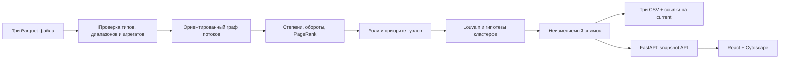

# Архитектура

## Поток данных



## Компоненты

- `scripts/fetch_data.py` читает публичный архив организатора без cookies/account либо локальный ZIP, проверяет SHA-256 и сигнатуры Parquet, пишет `data/source.json`.
- `backend/pipeline.py` строго проверяет наличие входных файлов, колонки, целочисленные типы и int64 диапазон, числовые суммы и даты, seed/depth consistency, endpoints, уникальность узлов/рёбер и соответствие транзакционных пар, сумм и количества `edges`.
- Pipeline создаёт ориентированный `networkx.DiGraph`; рассчитывает степени, потоки, концентрации и weighted PageRank собственной power iteration; присваивает роли последовательными правилами; приоритет — по процентильным рангам; кластеризация — Louvain на взвешенной неориентированной проекции.
- На каждый запуск CSV записываются в `out/.snapshots/<id>`. После полной записи `out/current` атомарно переключается на новый снимок. Корневые `out/*.csv` — стабильные ссылки на файлы текущего снимка. Повторный расчёт на этих данных дал идентичные байты.
- `backend/app.py` при старте рассчитывает один снимок и отдаёт summary, список и карточку узла, кластер, ограниченный подграф и CSV. В карточке есть раскрываемый разбор оборота/связей/PageRank/веса роли и формулы приоритета. Основные пути начинаются с `/api`; `/health` сохранён как alias `/api/health`. API работает с тем же immutable snapshot, что и экспорт.
- `frontend/` содержит интерфейс на React/Cytoscape: поиск числового `gid`, список приоритетов, фильтры роли и кластера, обзор сети, кластера и окрестности узла, карточку с потоками и предупреждениями. Рёбра направленные, цвет узла показывает его роль; можно приблизить граф или вписать его в окно. В окрестности выбранного узла входящие связи размещаются слева, исходящие справа, взаимные — снизу. Сначала показываются 20 контрагентов с наибольшей суммой прямых переводов в обе стороны. Кнопка «Показать всех» раскрывает уже загруженные данные, до серверного лимита 120 узлов; подпись показывает фактические количества связей. Масштаб вписывания ограничен коэффициентом 1,08; подписи видны у выбранного узла и при увеличении. Панель сведений показывает полный `gid`, точную сумму до двух знаков и число переводов. Наведение курсора или касание ребра выделяет его. Новых runtime-зависимостей нет, backend и расчёты не менялись.

## Среда запуска

Подтверждённая ОС — Linux; файловая система должна поддерживать POSIX symlink. macOS и WSL не проверялись. Python 3.14.3, `uv` 0.12.16, Node.js 24.21.0, npm 11.19.0. Локальный Uvicorn рекомендуется привязывать к `127.0.0.1:8000`. Переменные `MONEY_GRAPH_DATA`, `MONEY_GRAPH_OUT`, `MONEY_GRAPH_STATIC` читаются из процесса; `.env.example` автоматически не загружается.

```bash
uv sync --frozen
npm --prefix frontend ci
npm --prefix frontend run build
python3 scripts/fetch_data.py
uv run python -m backend.pipeline --data data --out out
uv run uvicorn backend.app:app --host 127.0.0.1 --port 8000
```

В compose один сервис `money-graph`: port `127.0.0.1:8000:8000`, `data/` mounted read-only, `out/` writable. Fetch выполняется на host под Python 3.10+; Docker image содержит runtime, но загрузчик на host запускается отдельно.

```bash
python3 scripts/fetch_data.py
docker compose up --build -d --wait
```

## Проверенные результаты

Полный CLI wall time — 0,99 с, внутренний analysis — 0,510786 с на предоставленном наборе: 2 248 узлов, 3 119 рёбер, 4 840 транзакций, 81 seed, 91 кластер, 35 weak components (16 с рёбрами и 19 isolates), 444 boundary, 365 890 012,01 KZT. В чистой копии 24 теста прошли за 3,04 с; Ruff, frontend lint/typecheck/build и `npm audit` (0 vulnerabilities) — PASS. Docker Compose build и `up --wait` завершились успешно, сервис healthy. HTTP summary готов; все три CSV выгрузки вернули 200 с attachment и ожидаемыми заголовками, содержат 2 248 / 91 / 100 строк и побайтно совпадают со снимком. Браузер получил download event для каждого CSV; интерфейс проверен на ширинах 1440 и 390 px без горизонтального переполнения и ошибок console. Регрессионный тест проверяет обнаружение переполнения при агрегации экстремальных конечных сумм.

Зависимости, fetch, тесты, CLI, frontend build и Docker прошли в чистой локальной копии; чистый remote clone на `94cc8a8` также прошёл загрузку набора, frontend/backend проверки, Docker и HTTP-проверку выгрузок. GitHub Actions job не запустился из-за billing lock организации/аккаунта. Новая геометрия графа проверена в браузере на desktop 1440 px и mobile 390 px: на мобильном проверены отсутствие горизонтального переполнения, поиск, раскрытие и сворачивание контрагентов, вписывание графа и выделение ребра; ошибок console не было. На больших обзорных графах и при раскрытии всех контрагентов нужно приближать и изучать сеть локально; в плотных окрестностях возможны пересечения узлов и подписей. [GitHub Actions](https://github.com/BAITC-Hacks/hack-6fcd7f48-agentforge/actions/workflows/verify.yml); конфигурация CI — [verify.yml](../.github/workflows/verify.yml).
