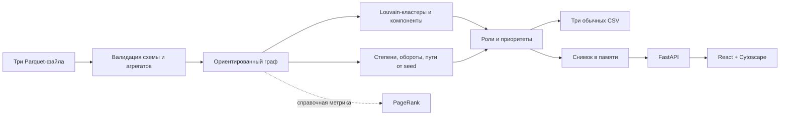

# Архитектура

## Поток обработки

## Компоненты

- `scripts/fetch_data.py` — необязательный способ получить публичный архив или проверить локальный ZIP. Основной сценарий — распаковать выданные три Parquet-файла в `data/`.
- `backend/pipeline.py` проверяет колонки и типы входа, конечность и диапазон чисел, даты, соответствие seed/depth, уникальность узлов и пар рёбер, endpoints и согласованность `edges` с `transactions`.
- Pipeline строит `networkx.DiGraph`, считает степени, суммы и концентрации по смежности, сохраняет до трёх кратчайших путей от seed и рассчитывает взвешенный PageRank собственной power iteration. Louvain использует взвешенную неориентированную проекцию графа с фиксированным seed=42.
- `collector_shape` вычисляется отдельно от назначения основной роли: не seed и не boundary, как минимум два непосредственных плательщика, положительный вход и `out_kzt / in_kzt ≤ 0,8`. По числу таких непосредственных соседей определяется coordinator; затем последовательно проверяются consolidator, distributor, transit, terminal и остаточная peripheral. Степени и обороты участвуют в объяснимых эвристиках силы роли и приоритета; PageRank не входит ни в ту, ни в другую формулу.
- CLI публикует `nodes_roles.csv`, `clusters.csv` и `top_nodes.csv` как обычные файлы в `out/`. Для каждого файла отдельно содержимое записывается во временный файл в целевом каталоге, затем `os.replace` заменяет итоговый файл. Сохранность одного файла при неудачной записи не означает атомарного переключения всех трёх сразу.
- `backend/app.py` при старте один раз вызывает расчёт с `write=False`, сохраняя узлы, рёбра, кластеры, сводку и байты CSV в snapshot в памяти. JSON-маршруты и CSV-выгрузки обслуживаются из этого неизменяемого снимка; API не пишет CSV в host `out/` и не пересчитывает их на GET. При изменении исходных файлов требуется перезапуск приложения для нового snapshot.
- `frontend/` — React и Cytoscape: поиск `gid`, список приоритетов, фильтры, обзор/кластер/окрестность, карточка узла и CSV-ссылки. Направления рёбер сохраняются; локальная раскладка окрестности помогает разбирать входящие, исходящие и взаимные связи, не меняя исходные финансовые данные. Большой или плотный граф требует приближения и точечного выбора; подписи могут пересекаться.

## Запуск

Основной сценарий после распаковки данных — `docker compose up --build -d --wait`; compose запускает один сервис на `127.0.0.1:8000` и монтирует `data/` только для чтения. Для одного расчёта без UI: `uv run python -m backend.pipeline --data data --out out`. Локальный UI запускается после установки Python-зависимостей через `uv sync --frozen` и frontend-пакетов через `npm --prefix frontend ci`, сборки `npm --prefix frontend run build` и старта Uvicorn на `127.0.0.1:8000`.

Настройки `MONEY_GRAPH_DATA`, `MONEY_GRAPH_OUT` и `MONEY_GRAPH_STATIC` читаются из окружения процесса. `.env.example` автоматически не загружается.

## Размер набора и масштаб

Фактический набор: 2 248 узлов, 3 119 рёбер, 4 840 транзакций, 81 seed, 91 кластер, 35 слабосвязных компонент (19 изолятов) и 444 узла depth=4. Детали и ограничения интерпретации — в [методологии](methodology.md); сценарии проверки — в [QA-отчёте](qa-report.md).

Масштаб около миллиона узлов не реализован и не тестировался. Для проектирования роста нужны замеры на целевом объёме; возможные направления — колоночная агрегация, CSR/igraph, приближённые PageRank и поиск сообществ, компактное хранение seed-достижимости, индексирование смежности API и ограничение отрисовки.
